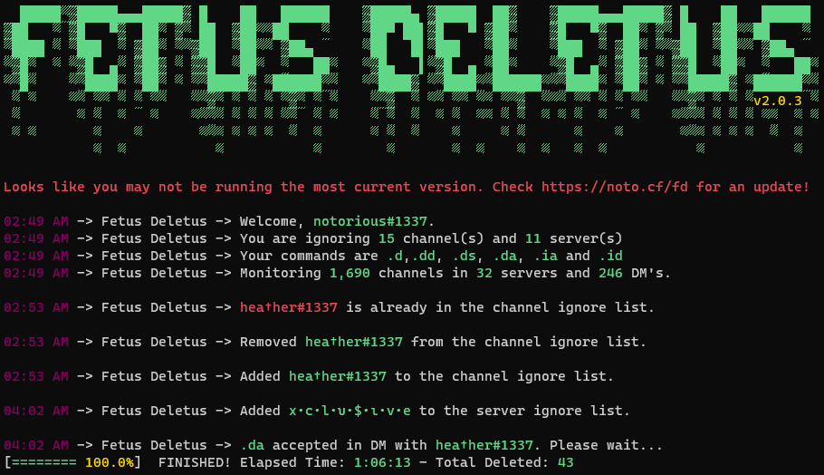

# Fetus-Deletus v2
Fetus Deletus is a Discord.py self-message deleter. Version 2 has been completely recoded from scratch in Python 3.8

[](https://github.com/noto-rious/Fetus-Deletus/releases)

### Features 
* Cross-platform support for Windows and Linux
* Has features that allow you to Delete all sent messages, all sent messages in servers, or all sent messages in dm.
* Has an ignore list for both guilds and dm's



### Settings
Edit `settings.json`
```
{
"token":"Token_Here",             //put your discord authorization token here(see instructions on how to obtain down below)
"command_prefix":".",             //this is the command prefix, the character before each command that will be used.
"del_command":"d",                //this command deletes all or a custom numerical variable(i.e. .d 2) sent messages in current channel.
"del_all_dms_command":"dd",       //this command deletes all sent dm messages for all users.
"del_all_servers_command":"ds",   //this command deletes all sent server messages for all servers.
"del_all_command":"da",           //this command deletes all sent dm and server messages for all users and all servers.
"ignore_add_command":"ia",        //type this command in the channel of the dm/guild you would like to ignore.
"ignore_del_command":"id"         //type this command in the channel of the dm/guild you would like to unignore.
}
```
***
### How to obtain your token
https://github.com/Tyrrrz/DiscordChatExporter/wiki/Obtaining-Token-and-Channel-IDs#how-to-get-a-user-token
***
### Disclaimer
This is a self-bot which is against Discord ToS. Use it at your own risk.


